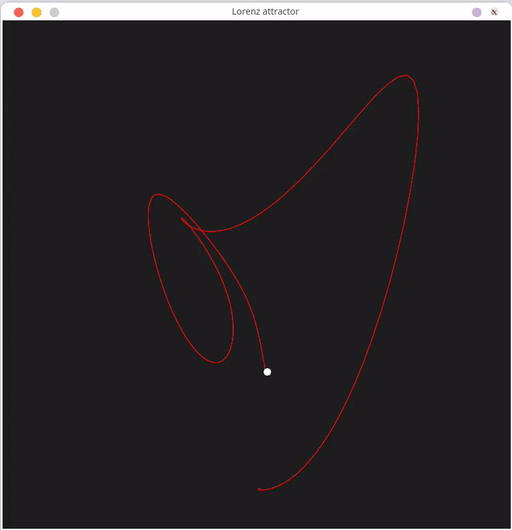

## Lorenz attractor

A Lorenz attractor, implemented in C++



### Building

Build with cmake to automatically pull in all dependencies:

```
cmake -S . -B build
cmake --build build -j 4
./build/src/Lorenz
```

### Controls

- **R** to reset (with a new starting position)
- **up/down arrows** to speed up/slow down.

### Acknowledgements

Graphics have been done with the help of the [SFML](https://github.com/SFML/SFML) library
